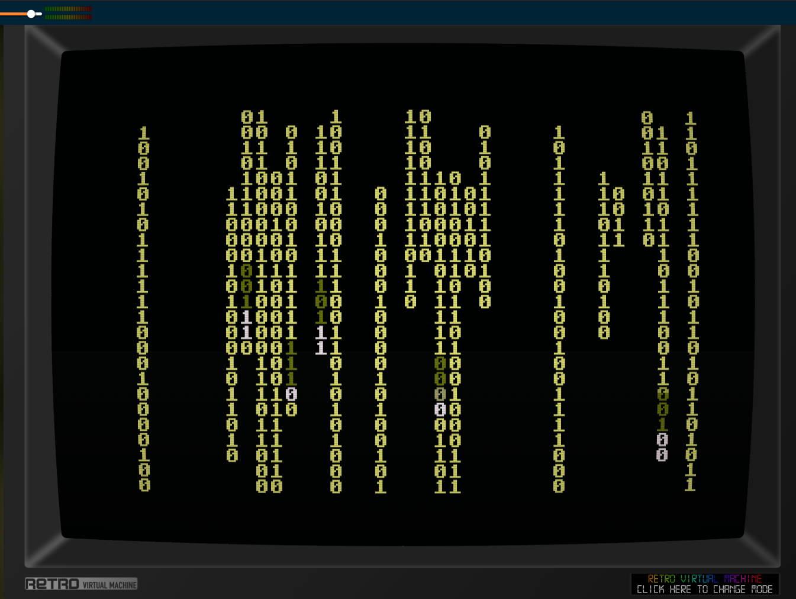

# symsav-xmatrix

A Matrix-style falling character screensaver for [SymbOS](https://www.symbos.org/) on the Amstrad CPC and MSX.

> **Alpha version — use at your own risk.** This software is in an early alpha state and may cause harm to your system. If you choose to try it, you do so entirely at your own risk.

Inspired by Jamie Zawinski's [xmatrix](https://www.jwz.org/xscreensaver/) from the xscreensaver suite.

---

## Building

```bash
./build.sh
```

Requires the SCC compiler (set `SCC=` env var if not at `../scc/bin/cc`) and Python 3.

Build steps:

1. SCC compiles `xmatrix.c` + `xmatrix_msx.s` → `xmatrix.sav`
2. `add_preview.py` patches the preview thumbnail into the binary at file offset 256

Output: `xmatrix.sav` — a single binary that runs on both CPC and MSX.

---

## Installing

1. Copy `xmatrix.sav` into your `C:\SYMBOS\` directory.
2. Open **Display Properties** and go to the **Screen Saver** tab.
3. Click **Browse** and select `xmatrix.sav`.
4. Click **Setup** to configure the effect:
   - **Style**: Binary (`0`/`1` digits) or Kana (Katakana-style glyphs)
   - **Density**: Sparse / Normal / Dense — how many column streams activate per frame
   - **Speed**: Slow / Normal / Fast — controls the frame skip (6 / 3 / 1 idle ticks between frames)

---

## Effect

The screensaver adapts automatically to the platform it runs on:

### Amstrad CPC

- 40×25 grid of 8×8 pixel characters on the 320×200 Mode 1 screen (4 colours)
- Trail colours: white (ink 0) → bright green (ink 3) → dim green (ink 2); background black (ink 1)

### MSX

- 64×26 grid of 8×8 pixel characters on the 512×212 Screen 7 (16 colours)
- Trail colours: white → gray → light green → medium green; background black
- Screen written directly via VDP ports (0x98/0x99) using V9938 Screen 7 4bpp nibble format

### Both platforms

- Columns of random characters fall from the top
- Each new character glows through 4 colour stages as it ages, then settles to the dim trail colour
- Two selectable glyph sets:
  - **Binary**: digits `0` and `1` (2 glyphs)
  - **Kana**: 9 Katakana characters — エ (e), コ (ko), ス (su), ト (to), ネ (ne), ク (ku), ロ (ro), モ (mo), ツ (tsu)

Glyphs are defined as ASCII art strings in `xmatrix.c` and encoded into platform-specific byte arrays at startup by `build_font()`.

---

## Screensaver protocol

Standard SymbOS screensaver messages:

| Message | Action |
|---------|--------|
| `MSC_SAV_INIT` (1) | Load saved config from manager |
| `MSC_SAV_START` (2) | Start fullscreen animation |
| `MSC_SAV_CONFIG` (3) | Open config dialog |
| `MSR_SAV_CONFIG` (4) | Send updated config back |

Config is 6 bytes: magic `"MATX"` + style byte + density byte + speed byte.

---

## Animation

Platform is detected at runtime via `Sys_Type()`. The animation loop is the same on both platforms:

1. Open a fullscreen `WIN_NOTTASKBAR | WIN_NOTMOVEABLE` window
2. `DSK_SRV_DSKSTP` to freeze the desktop
3. Clear the screen
4. Per frame: advance column feeders, decay glow, redraw only dirty cells
5. Exit on any key or mouse movement: resume desktop, close window, `Screen_Redraw()`

### CPC screen access

Characters are written 8 scanlines at a time via `Bank_Copy` to screen bank 0. Scanline address for character cell (cx, cy), row r:

```
addr = 0xC000 + cy*80 + cx*2 + r*0x800
```

### MSX screen access

Characters are written via direct VDP port I/O (`xmatrix_msx.s`). Screen 7 VRAM address for character cell (cx, cy), row r:

```
addr = cy*2048 + r*256 + cx*4
```

R#14 is set once per character draw (bits 15:14 of the base address). All 8 rows are written in a single assembly call to avoid repeated function call overhead.
